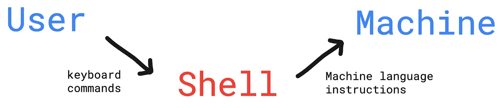
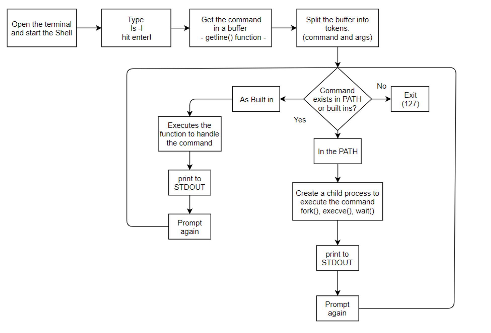

# Project: 0x16. C - Simple Shell


A simple UNIX command language interpreter that reads commands from either a file or standard input and executes them.

## Table of Contents
1. [What is a shell?](#what-is-a-shell)
2. [How the shell works](#how-the-shell-works)
3. [Description](#description)
4. [Features](#features)
5. [Installation](#installation)
6. [Usage](#usage)
7. [Built-in Commands](#built-in-commands)
8. [Environment](#environment)
9. [Exit Status](#exit-status)
10. [Signals](#signals)
11. [Command Execution](#command-execution)
12. [Operators](#operators)
13. [Examples](#examples)
14. [Troubleshooting](#troubleshooting)
16. [Contact](#authors)

## What is a shell?
A shell is a program that takes the command inputs written from the the user’s keyboard and passes them to the machine to execute them through the kernel. It also verifies if the command inputs from the user are correct.



So, in general, a Shell is a user interface to use the services of a computer.

## How the shell works

The shell follows a simple cycle:

1. **R**ead: Accept input from the user
2. **E**valuate: Interpret the command
3. **P**rint: Display the output
4. **L**oop: Return to step 1



### How hsh works
* Prints a prompt and waits for a command from the user.
* Creates a child process in which the command is checked.
* Checks for built-ins, aliases in the PATH, and local executable programs.
* The child process is replaced by the command, which accepts arguments.
* When the command is done, the program returns to the parent process and prints the prompt.
* The program is ready to receive a new command
* To exit: press Ctrl-D or enter "exit" (with or without a status).
* Works also in non interactive mode.

## Description

**hsh** is a simple UNIX command language interpreter developed as part of the ALX Software Engineering program. It mimics the basic functionality of the Bash shell, providing a command-line interface for users to interact with their system.

## Features

- Executes commands from files or standard input
- Supports built-in commands like `cd`, `exit`, `env`, `setenv`, and `unsetenv`
- Handles command separators (`;`) and logical operators (`&&`, `||`)
- Manages environment variables
- Supports comments (lines starting with `#`)
- Works in both interactive and non-interactive modes

## Installation

### Prerequisites
- GCC compiler
- Linux environment (Ubuntu 20.04 LTS recommended)

### Steps

1. Clone the repository:

```bash
git clone https://github.com/hackerSa3edy/simple_shell.git
```

2. Navigate to the project directory:

```bash
cd simple_shell
```

3. Compile the program:

```bash
gcc -Wall -Werror -Wextra -pedantic -std=gnu89 *.c -o hsh
```

## Usage

### Interactive Mode
Run the shell:
```bash
./hsh
```

You will see a prompt where you can type commands:

```bash
$ ls -l
$ pwd
$ echo Hello, World!
```

### Non-Interactive Mode
Execute commands from a file:

```bash
./hsh < commands.txt
```

Or pipe commands to the shell:

```bash
echo "ls -l" | ./hsh
```

## Built-in Commands

- `cd [DIRECTORY]`: Change the current directory
- `exit [STATUS]`: Exit the shell with a given status
- `env`: Print the current environment
- `setenv [VARIABLE] [VALUE]`: Set an environment variable
- `unsetenv [VARIABLE]`: Unset an environment variable

## Environment

The shell uses the following environment variables:

- `HOME`: The home directory of the current user
- `PWD`: The current working directory
- `OLDPWD`: The previous working directory
- `PATH`: A colon-separated list of directories to search for commands

## Exit Status

**hsh** returns the exit status of the last command executed, with zero indicating success and non-zero indicating failure.

If a command is not found, the return status is `127`; if a command is found but is not executable, the return status is 126.

All builtins return zero on success and one or two on incorrect usage (indicated by a corresponding error message).

## Signals

While running in interactive mode, **hsh** ignores the keyboard input `Ctrl+c`. Alternatively, an input of end-of-file (`Ctrl+d`) will exit the program.

User hits `Ctrl+d` in the third line.
```
$ ./hsh
$ ^C
$ ^C
$
```

## Command Execution

Upon receiving a command, **hsh** tokenizes it into words using spaces as delimiters. The first word is interpreted as the command, while all subsequent words are treated as arguments. **hsh** then proceeds with the following steps:

1. If the command doesn't begin with a slash (`/`) or dot (`.`), the shell first checks its list of built-in functions. If a matching built-in is found, it is executed.

2. If the command doesn't start with a slash (`/`), dot (`.`), and isn't a built-in function, **hsh** searches for an executable file with the command name in each directory listed in the **PATH** environment variable.

3. If the command begins with a slash (`/`) or dot (`.`), or if either of the above searches succeeds, the shell executes the specified program with any provided arguments in a separate execution environment.


## Operators

- `;`: Command separator
- `&&`: AND logical operator
- `||`: OR logical operator

## Examples

### Using command separator

```bash
$ echo Hello ; ls
```
```
# Output
Hello
file1 file2 file3
```

### Using AND operator

```bash
$ mkdir test && cd test && pwd
```
```
# Output
/home/user/test
```

### Using OR operator

```bash
$ ls /nonexistent || echo "Directory not found"
```
```
# Output
Directory not found
```

## Troubleshooting

- **Command not found**: Ensure the command exists and is in your PATH
- **Permission denied**: Check if you have the necessary permissions to execute the file
- **Syntax errors**: Verify your command syntax, especially when using operators


## Authors
- [Abdelrahman Mohamed](https://x.com/hackersa3edy)
